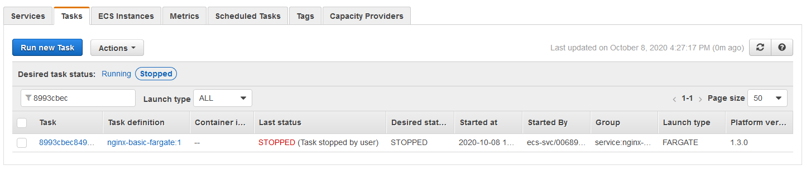
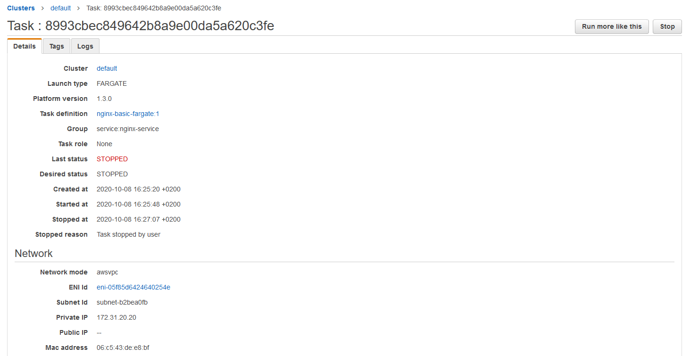
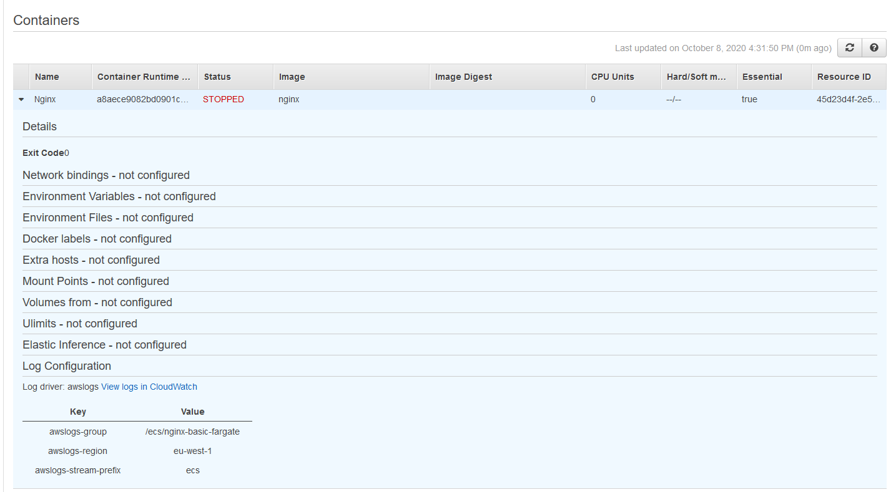
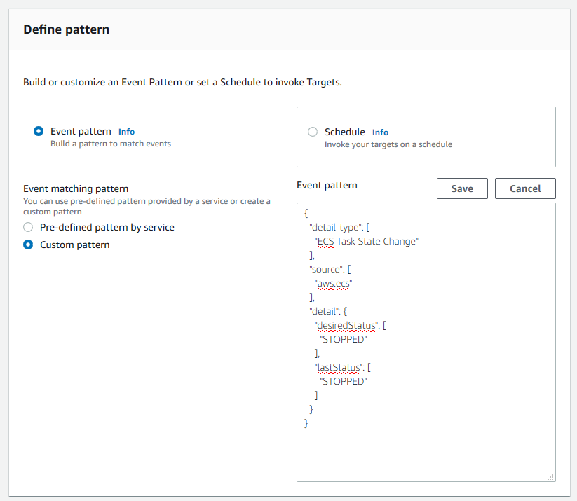
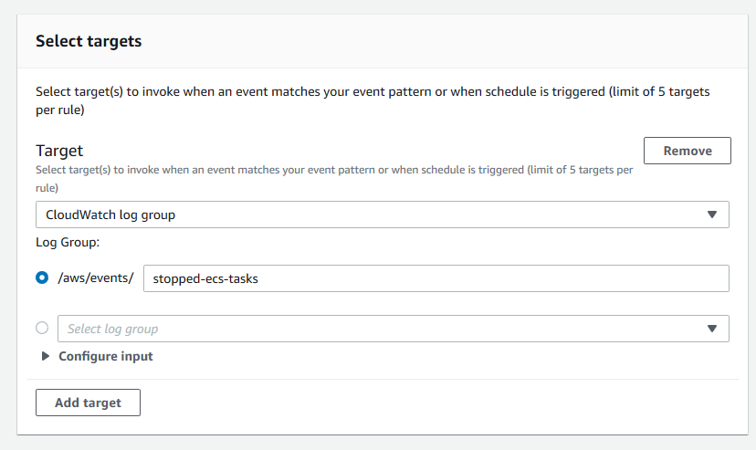
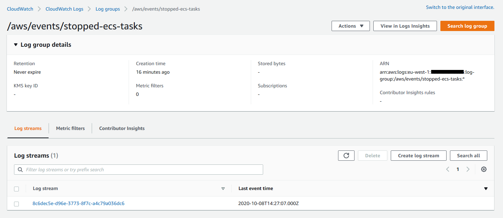

+++
date = 2020-10-08
draft = false
title = 'How to store ECS Stopped Task Details'
description = 'How to store the task details for ECS stopped tasks using EventBridge and CloudWatch logs'
weight = 10
[params]
  author = 'Jenade Moodley'
showHero = true
heroStyle = 'background'
summary = 'Summary'
categories = ['AWS', 'ECS']
tags = ['AWS', 'ECS', 'CloudWatch']
+++


<p class="text-xs text-neutral-500 dark:text-neutral-400">Photo: EPA/MARITIME NEW ZEALAND</p>

## The Importance of Stopped Task Details

When you are running containers in ECS, there are times in which the task suddenly stops. Often times these tasks are part of an ECS service and so they will be restarted, but if your architect is not stateless and those stopped task caused errors, then the task stopping can cause an issue with your application. An example of this would be a container which uses socket connections such as Redis.

In such cases, knowing the cause of the task stopping would be of utmost importance as you would need to prevent the task from stopping again. This fact reigns true even more so in production environments, where you also need to report on why any failures occurred in the environment. On ECS, when a task is stopped, you would be able to view the stopped task in your ECS console. When you select your cluster, you can select the Tasks tab which contains a list of stopped tasks.



You can also select the task to view even more task details, as well as the container details (including the exit code) from each container. The container code is extremely useful if the task was stopped due to a container level issue, such as out of memory errors.





## Why do we Need to Store ECS Stopped Tasks?

The above information is certainly useful. Unfortunately, stopped ECS task details only remain in the console for at least an hour, after which it is removed. If you notice that the task was stopped after an hour, chances are that you will not be able to view the reason why the task was stopped. This is mentioned in AWS documentation:

> Recently stopped tasks might appear in the returned results. Currently, stopped tasks appear in the returned results for at least one hour. 


## Implementing the Solution

The solution is actually really simple. When a task is stopped, there is a [CloudWatch event](https://docs.aws.amazon.com/AmazonCloudWatch/latest/events/WhatIsCloudWatchEvents.html) which is triggered to signal that the state of a task has been changed. In ECS, this would be called a [Task state change event](https://docs.aws.amazon.com/AmazonECS/latest/developerguide/ecs_cwe_events.html#ecs_task_events). We can then use a service called [Amazon EventBridge](https://docs.aws.amazon.com/eventbridge/latest/userguide/what-is-amazon-eventbridge.html) to react to this event, and store the details of the event in a [CloudWatch log stream](https://docs.aws.amazon.com/AmazonCloudWatch/latest/logs/Working-with-log-groups-and-streams.html).

1. To get started, first navigate to the [Amazon EventBridge console](https://console.aws.amazon.com/events/). Ensure that you are in the same region as the ECS cluster that you want to monitor.
2. In the navigation pane, choose `Rules`.
3. Choose `Create rule`.
4. Enter a name and description for the rule. A rule can't have the same name as another rule in the same Region and on the same event bus.
5. For `Define pattern`, choose `Event pattern`.
6. Choose `Custom pattern`.
7. Paste the below JSON snippet into the Event pattern text window and click `Save`.

    ```json
    {
      "detail-type": [
        "ECS Task State Change"
      ],
      "source": [
        "aws.ecs"
      ],
      "detail": {
        "desiredStatus": [
          "STOPPED"
        ],
        "lastStatus": [
          "STOPPED"
        ]
      }
    }
    ```
    It should look like the below in the EventBridge console.
    

8. For `Select targets`, choose `CloudWatch log group`.
9. Provide a name for the log group, or choose an existing log group. The resulting target should look like below in the console.
    
10. Click `Create`.


## Results

Should a task be stopped for any reason, the details of the task will be saved to the log stream. The log will be saved under the task ID for the stopped task.



The resulting log entry will contain a JSON output containing the stopped task details.

```json
{
    "version": "0",
    "id": "ba5eb4e7-60be-82a2-621a-4a1b11112b5b",
    "detail-type": "ECS Task State Change",
    "source": "aws.ecs",
    "account": "<ACCOUNT_ID_REDACTED>",
    "time": "2020-10-08T14:27:07Z",
    "region": "eu-west-1",
    "resources": [
        "arn:aws:ecs:eu-west-1:<ACCOUNT_ID_REDACTED>:task/default/8993cbec849642b8a9e00da5a620c3fe"
    ],
    "detail": {
        "attachments": [
            {
                "id": "a6fcab45-6aa4-4c37-bd0e-e1a2ad30a6d2",
                "type": "eni",
                "status": "DELETED",
                "details": [
                    {
                        "name": "subnetId",
                        "value": "subnet-b2bea0fb"
                    },
                    {
                        "name": "networkInterfaceId",
                        "value": "eni-05f85d6424640254e"
                    },
                    {
                        "name": "macAddress",
                        "value": "06:c5:43:de:e8:bf"
                    },
                    {
                        "name": "privateIPv4Address",
                        "value": "172.31.20.20"
                    }
                ]
            }
        ],
        "availabilityZone": "eu-west-1b",
        "clusterArn": "arn:aws:ecs:eu-west-1:<ACCOUNT_ID_REDACTED>:cluster/default",
        "containers": [
            {
                "containerArn": "arn:aws:ecs:eu-west-1:<ACCOUNT_ID_REDACTED>:container/45d23d4f-2e5c-4781-8cd7-cb521deae872",
                "exitCode": 0,
                "lastStatus": "STOPPED",
                "name": "Nginx",
                "image": "nginx",
                "runtimeId": "a8aece9082bd0901c023c191be013bbd11c129f288647dfa53002661d8285057",
                "taskArn": "arn:aws:ecs:eu-west-1:<ACCOUNT_ID_REDACTED>:task/default/8993cbec849642b8a9e00da5a620c3fe",
                "networkInterfaces": [
                    {
                        "attachmentId": "a6fcab45-6aa4-4c37-bd0e-e1a2ad30a6d2",
                        "privateIpv4Address": "172.31.20.20"
                    }
                ],
                "cpu": "0"
            }
        ],
        "createdAt": "2020-10-08T14:25:20.227Z",
        "launchType": "FARGATE",
        "cpu": "512",
        "memory": "1024",
        "desiredStatus": "STOPPED",
        "group": "service:nginx-service",
        "lastStatus": "STOPPED",
        "overrides": {
            "containerOverrides": [
                {
                    "name": "Nginx"
                }
            ]
        },
        "connectivity": "CONNECTED",
        "connectivityAt": "2020-10-08T14:25:33.981Z",
        "pullStartedAt": "2020-10-08T14:25:39.75Z",
        "startedAt": "2020-10-08T14:25:48.75Z",
        "startedBy": "ecs-svc/0068978569384120015",
        "stoppingAt": "2020-10-08T14:26:43.833Z",
        "stoppedAt": "2020-10-08T14:27:07.323Z",
        "pullStoppedAt": "2020-10-08T14:25:46.75Z",
        "executionStoppedAt": "2020-10-08T14:26:44Z",
        "stoppedReason": "Task stopped by user",
        "stopCode": "UserInitiated",
        "updatedAt": "2020-10-08T14:27:07.323Z",
        "taskArn": "arn:aws:ecs:eu-west-1:<ACCOUNT_ID_REDACTED>:task/default/8993cbec849642b8a9e00da5a620c3fe",
        "taskDefinitionArn": "arn:aws:ecs:eu-west-1:<ACCOUNT_ID_REDACTED>:task-definition/nginx-basic-fargate:1",
        "version": 6,
        "platformVersion": "1.3.0"
    }
}
```


And that's about it. Very simple to setup, and very useful in the event when you do need to troubleshoot stopped tasks. Let me know your thoughts or any concerns in the comments below, and feel free to adjust these steps to meet your use-case.